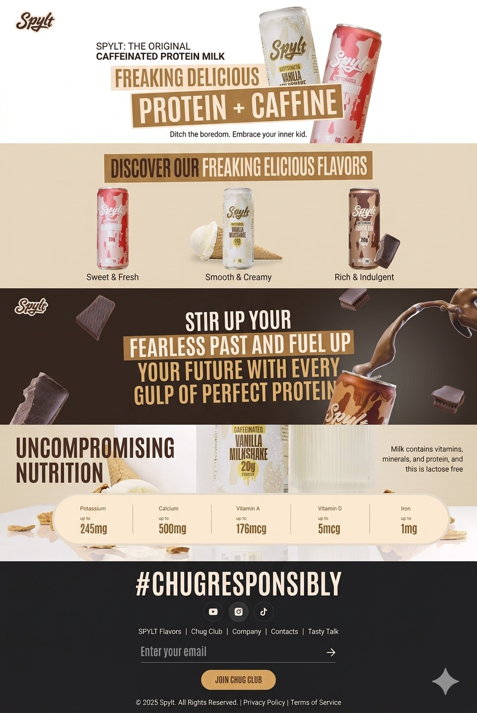

<div >
 <br />
  <div align="center" >
   <a>
     
   </a></div>
 <br />
 <br />

 <div>

 </div>

 <h3 style="font-weight:700;font-size:30px;">Splyt Cold-Drink Website</h3>

  <div >
    A replica of  website that has won an Awwwards Site of the Day.
    This is a stunning, interactive site using <b>GSAP</b>, <b>ReactJS</b>, and <b>Tailwind CSS</b>.
   </div>
</div>

## Introduction
A cutting-edge web experience designed for Awwwards recognition, with **GSAP (GreenSock Animation Platform)** at its core. This project demonstrates how to leverage GSAP's powerful animation capabilities to craft fluid transitions, captivating scroll effects, and dynamic UI interactions, combining it with React and Tailwind CSS for a truly immersive and visually stunning website.

## Tech Stack

- ⚛️ React 19
- 🌀 Tailwind CSS v4
- 🎞️ GSAP (GreenSock Animation Platform)

## Features

- ✨ Parallax Effect
- ⚡️ Clip-Path Magic
- 🕹️ ScrollTrigger & ScrollSmoother
- 👏 GSAP Timelines 
- 📱 Fully responsive and mobile-friendly

## Quick Start

```bash
# 1. Clone the repo
git clone [https://github.com/NextMutant/gsap-awwwards-website.git](https://github.com/NextMutant/ColdDrink.git)

# 2. Install dependencies
npm install

# 3. Start the dev server
npm run dev

